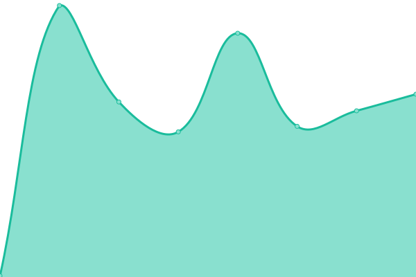

# [📈 Live Status](https://alexbula.github.io/test_status): <!--live status--> **🟧 Partial outage**

This repository contains the open-source uptime monitor and status page for [alexbula](https://alexbula.github.io/test_status), powered by [Upptime](https://github.com/upptime/upptime).

With [Upptime](https://upptime.js.org), you can get your own unlimited and free uptime monitor and status page, powered entirely by a GitHub repository. We use [Issues](https://github.com/alexbula/test_status/issues) as incident reports, [Actions](https://github.com/alexbula/test_status/actions) as uptime monitors, and [Pages](https://alexbula.github.io/test_status) for the status page.

<!--start: status pages-->
<!-- This summary is generated by Upptime (https://github.com/upptime/upptime) -->
<!-- Do not edit this manually, your changes will be overwritten -->
<!-- prettier-ignore -->
| URL | Status | History | Response Time | Uptime |
| --- | ------ | ------- | ------------- | ------ |
|  [Iam Unagi](https://iam.europe-west3.unagi.dev02.nttclouds.co/diagnostics/v1alpha2:healthcheck) | 🟥 Down | [iam-unagi.yml](https://github.com/AlexBula/test_status/commits/HEAD/history/iam-unagi.yml) | 

 2199ms
     
 | 

<a href="https://alexbula.github.io/test_status/history/iam-unagi">27.90%</a>
    

|  [Applications Unagi](https://applications.europe-west3.unagi.dev02.nttclouds.co/diagnostics/v1alpha2:healthcheck) | 🟩 Up | [applications-unagi.yml](https://github.com/AlexBula/test_status/commits/HEAD/history/applications-unagi.yml) | 

 228ms
     
 | 

<a href="https://alexbula.github.io/test_status/history/applications-unagi">52.59%</a>
    

|  [Devices Unagi](https://devices.europe-west3.unagi.dev02.nttclouds.co/diagnostics/v1alpha2:healthcheck) | 🟩 Up | [devices-unagi.yml](https://github.com/AlexBula/test_status/commits/HEAD/history/devices-unagi.yml) | 

 223ms
     
 | 

<a href="https://alexbula.github.io/test_status/history/devices-unagi">52.59%</a>
    

|  [Audit Unagi](https://audit.europe-west3.unagi.dev02.nttclouds.co/diagnostics/v1alpha2:healthcheck) | 🟩 Up | [audit-unagi.yml](https://github.com/AlexBula/test_status/commits/HEAD/history/audit-unagi.yml) | 

 232ms
     
 | 

<a href="https://alexbula.github.io/test_status/history/audit-unagi">52.59%</a>
    

|  [Limits Unagi](https://limits.europe-west3.unagi.dev02.nttclouds.co/diagnostics/v1alpha2:healthcheck) | 🟥 Down | [limits-unagi.yml](https://github.com/AlexBula/test_status/commits/HEAD/history/limits-unagi.yml) | 

 216ms
     
 | 

<a href="https://alexbula.github.io/test_status/history/limits-unagi">0.00%</a>
    

|  [Logging Unagi](https://logging.europe-west3.unagi.dev02.nttclouds.co/diagnostics/v1alpha2:healthcheck) | 🟥 Down | [logging-unagi.yml](https://github.com/AlexBula/test_status/commits/HEAD/history/logging-unagi.yml) | 

 197ms
     
 | 

<a href="https://alexbula.github.io/test_status/history/logging-unagi">0.00%</a>
    

|  [Meta Unagi](https://meta.europe-west3.unagi.dev02.nttclouds.co/diagnostics/v1alpha2:healthcheck) | 🟩 Up | [meta-unagi.yml](https://github.com/AlexBula/test_status/commits/HEAD/history/meta-unagi.yml) | 

 226ms
     
 | 

<a href="https://alexbula.github.io/test_status/history/meta-unagi">52.58%</a>
    

|  [Monitoring Unagi](https://monitoring.europe-west3.unagi.dev02.nttclouds.co/diagnostics/v1alpha2:healthcheck) | 🟩 Up | [monitoring-unagi.yml](https://github.com/AlexBula/test_status/commits/HEAD/history/monitoring-unagi.yml) | 

 218ms
     
 | 

<a href="https://alexbula.github.io/test_status/history/monitoring-unagi">52.58%</a>
    

|  [Proxies Unagi](https://proxies.europe-west3.unagi.dev02.nttclouds.co/diagnostics/v1alpha2:healthcheck) | 🟩 Up | [proxies-unagi.yml](https://github.com/AlexBula/test_status/commits/HEAD/history/proxies-unagi.yml) | 

 210ms
     
 | 

<a href="https://alexbula.github.io/test_status/history/proxies-unagi">52.58%</a>
    

|  [Secrets Unagi](https://secrets.europe-west3.unagi.dev02.nttclouds.co/diagnostics/v1alpha2:healthcheck) | 🟩 Up | [secrets-unagi.yml](https://github.com/AlexBula/test_status/commits/HEAD/history/secrets-unagi.yml) | 

 209ms
     
 | 

<a href="https://alexbula.github.io/test_status/history/secrets-unagi">52.58%</a>
    

|  [STG Smoke Tests](https://api.github.com/repos/cloudwan/qa/actions/workflows/25360914/runs?per_page=1&page=1&status=completed) | 🟥 Down | [stg-smoke-tests.yml](https://github.com/AlexBula/test_status/commits/HEAD/history/stg-smoke-tests.yml) | 

 222ms
     
 | 

<a href="https://alexbula.github.io/test_status/history/stg-smoke-tests">100.00%</a>
    

<!--end: status pages-->

[**Visit our status website →**](https://alexbula.github.io/test_status)

## 📄 License

- Powered by: [Upptime](https://github.com/upptime/upptime)
- Code: [MIT](./LICENSE) © [alexbula](https://alexbula.github.io/test_status)
- Data in the `./history` directory: [Open Database License](https://opendatacommons.org/licenses/odbl/1-0/)
